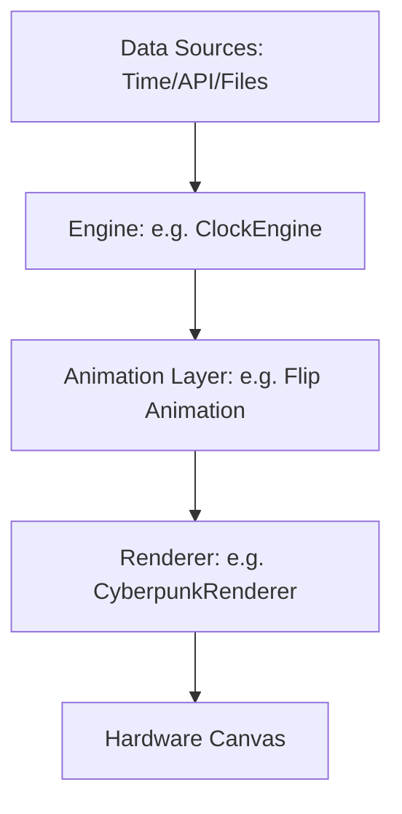

# Architecture Overview

This document explains how ArcadeMatrix works under the hood.

## The Core Loop

ArcadeMatrix uses a simple linear event loop to display frames on the hardware matrix. 

1. **`main.py`** initializes the `Config` and `MatrixWrapper`.
2. It starts a Flask web server on a background thread for the API.
3. It creates engines (`ClockEngine`, `DateEngine`, `WeatherEngine`, `GifEngine`, `FighterEngine`).
4. The `RotationEngine` begins an infinite loop, calling `engine.run(duration)` for each active feature sequentially.

## The Rendering Pipeline

To draw pixels, we separate the responsibilities into Data, Engine, Animation, and Rendering.

## Threading

Rendering must occur on the main thread because the `rgbmatrix` C++ library uses hardware PWM that is sensitive to timing and context switches. Do NOT use Python `threading` or `asyncio` for pixel manipulation or loops inside the engines. The API Server runs on a background thread and communicates with the main thread using shared state (`Config`) and thread-safe flags (`config.reload_flag`).
